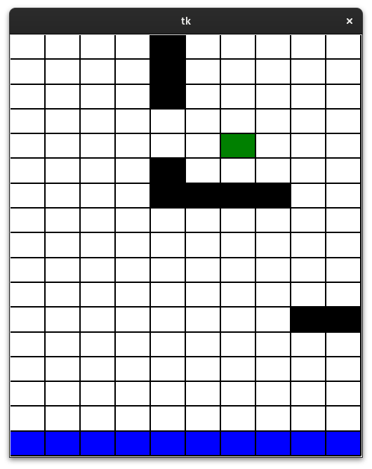
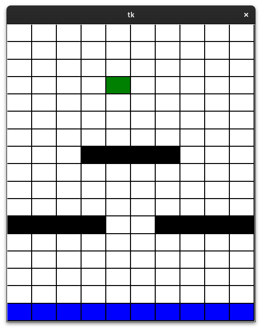
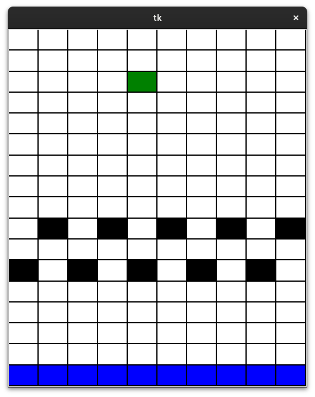
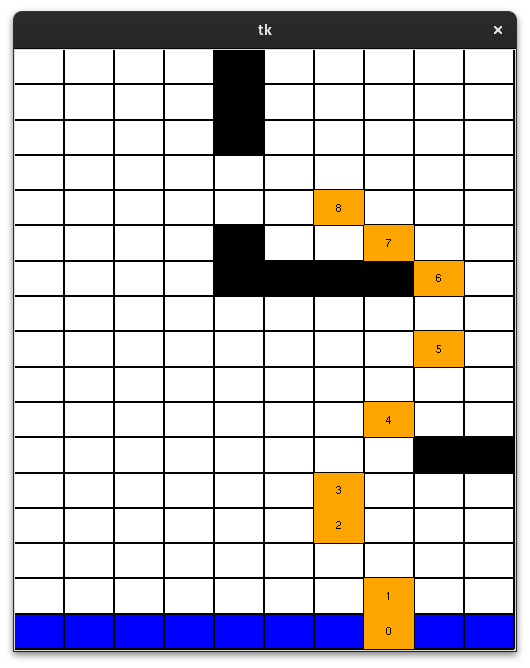
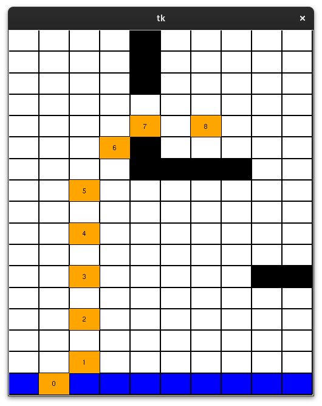

# Reinforce Path-Explorer
In this project, we have implemented On-policy first-visit Monte Carlo control algorithm to solve a path finding reinforcement learning problem. We use $\epsilon$-soft policies to explore the state space and improve the policy, while learning a Q-function (state-action value function) that estimates the expected return of taking an action in a state and following a policy thereafter. We use the Q-function to improve the policy by selecting the action that maximizes the expected return in a state. We have implemented the algorithm in Python with the main algorithm in the `monte_carlo.py` file. Additionally we have created a visual environment in `game.py` for analyzing the learned policy, as well as a map editor in the `map.py` file to create custom maps for the environment. 

## Problem
The problem is to find the shortest path from the start position to the goal in a grid world. The agent is aware of its position as well as a velocity vector. At each time step, the agent can change its velocity by adding an acceleration into one of the eight possible directions. This is limited by an absolute value for each velocity component.

## Environment
The environment is a 2D grid world with a start and goal position. The environment gives negative rewards for each time step and a positive reward when the agent reaches the goal. Additionally, if the agent hits a wall or goes out of bounds, it receives a negative reward and is reset to a random start position. Example maps for the environment are shown below:

Map 1 | Map 2 | Map 3
--- | --- | ---
 |  | 

## Training
We first train the agent by letting it play the game 10000 times. We use a high exploration rate to ensure that the agent explores the state space and learns a good policy. We then use the learned policy to play the game and visualize the learned policy. The learned policy for the first map is shown below on two different starting positions:

Start 1 | Start 2
--- | ---
 | 